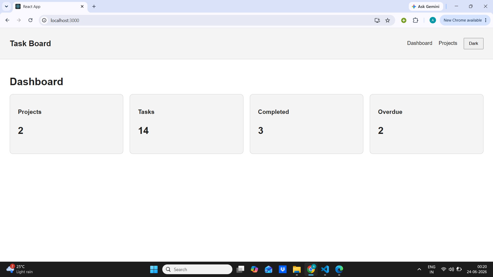
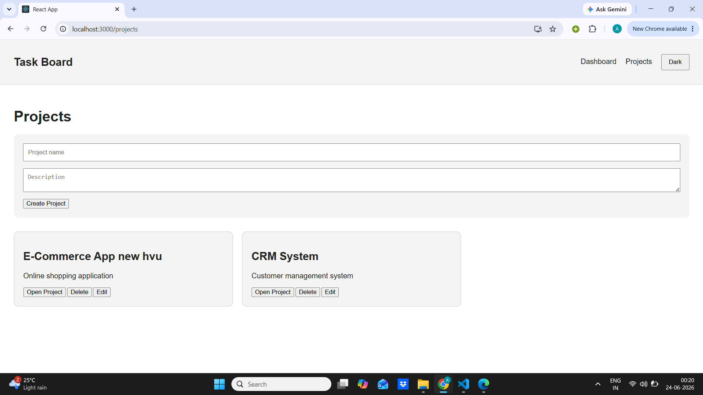
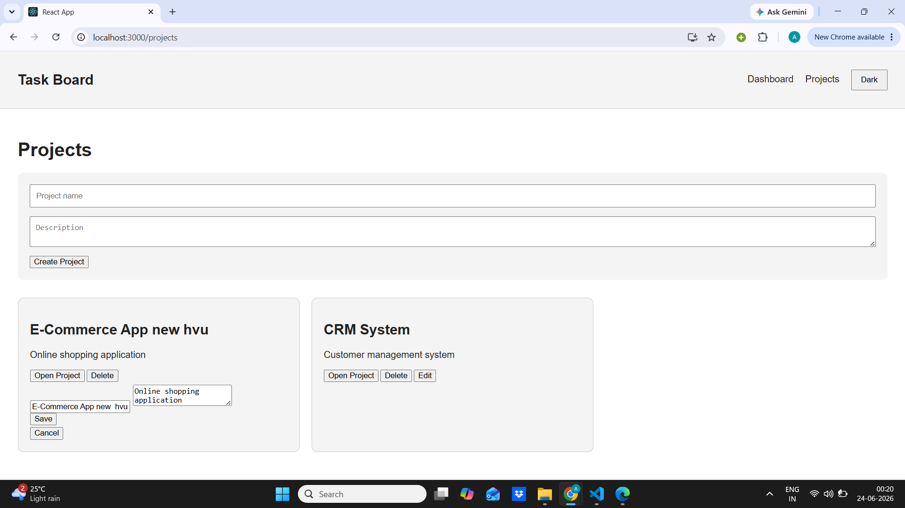
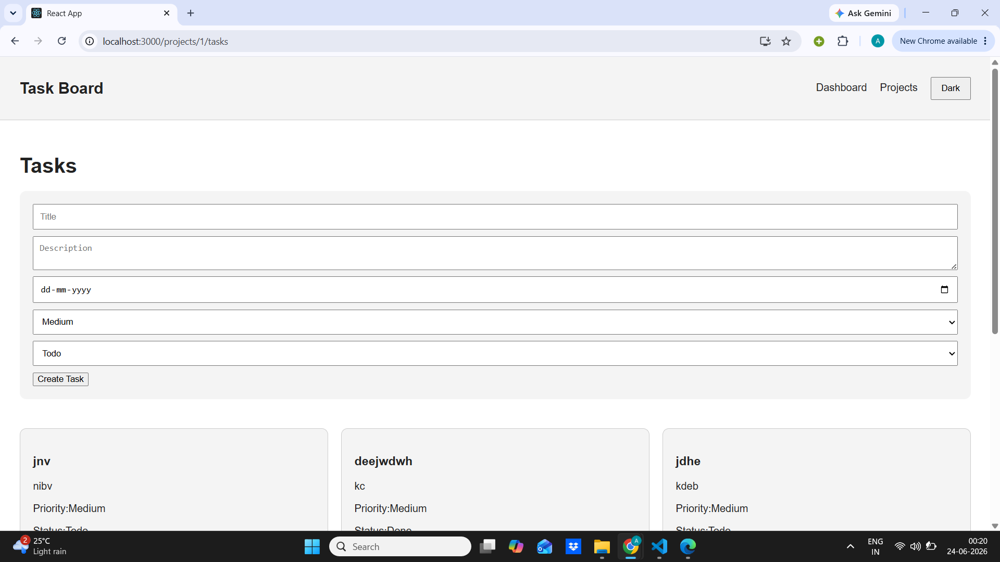
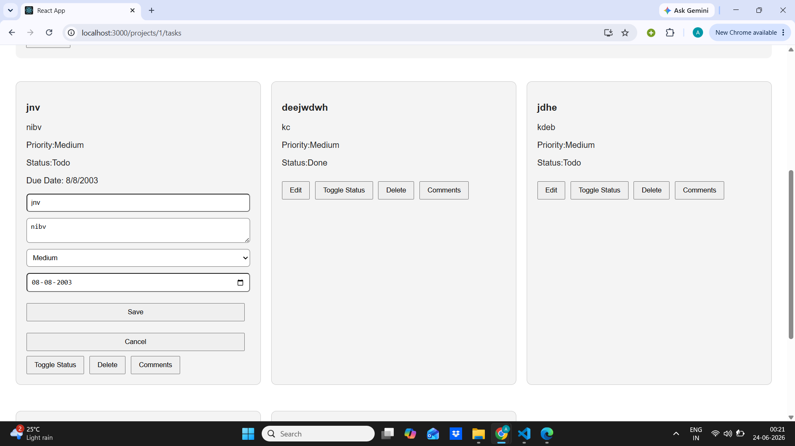
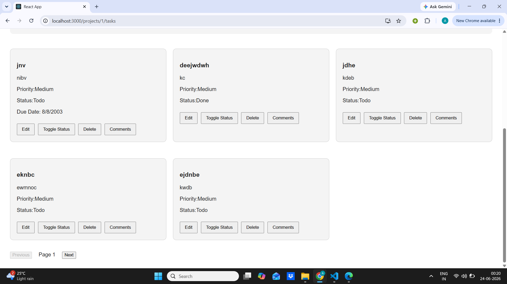
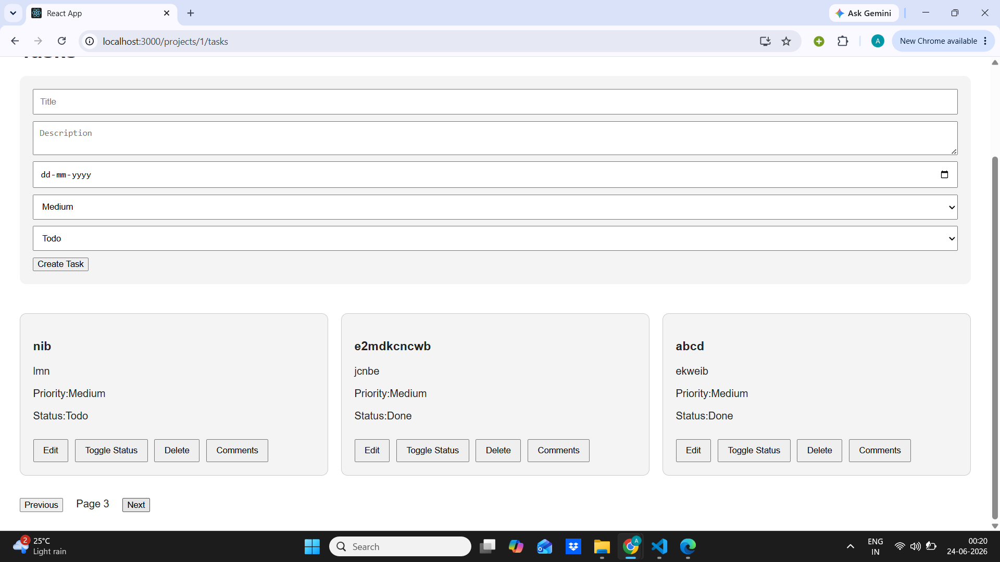
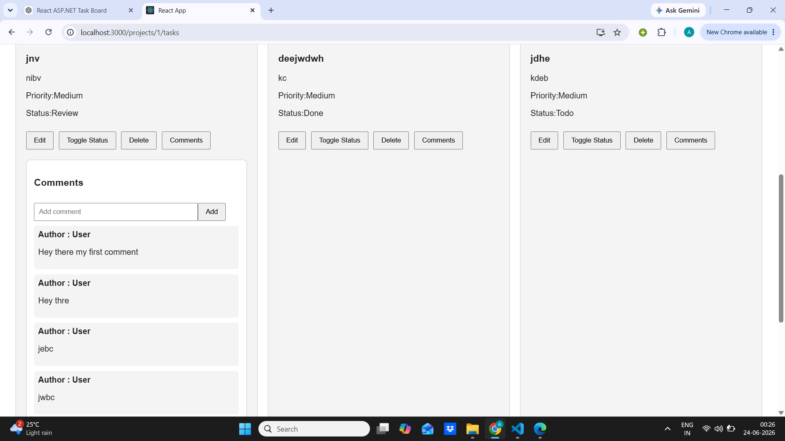

# Project Task Board

Full-stack Task Board application built using **ASP.NET Core Web API (.NET 8)** and **React**.

The application allows users to manage projects, tasks, and comments with task tracking features.


## Tech Stack

### Backend
- ASP.NET Core Web API (.NET 8)
- Entity Framework Core
- SQLite Database
- xUnit Testing

### Frontend
- React
- React Router
- Context API
- Custom API Hook


# Features Implemented

## Projects
- Create project
- View projects
- Update project
- Delete project

## Tasks
- Create tasks
- View tasks
- Update tasks
- Delete tasks
- Change task status
- Priority handling
- Due date support
- Pagination

## Comments
- Add comments
- View comments


# Bonus Features Implemented

## 1. Backend Unit Tests
Implemented xUnit tests for Task service layer.

Covered:
- Create task
- Update task
- Delete task
- Task retrieval


## 2. Dark Mode
Implemented using React Context API.

Features:
- Global theme handling
- Theme persistence using local storage


# Project Structure

```
Task-board-Solution

├── TaskBoard.Api
│   ├── Controllers
│   ├── Services
│   ├── Models
│   ├── DTOs
│   └── Data
│
├── TaskBoard.Test
│   └── xUnit Tests
│
└── task-board-ui
    └── React Application
```


# Prerequisites

Install:

- .NET 8 SDK
- Node.js
- npm


Check versions:

```
dotnet --version
node -v
npm -v
```


# Database Setup

The project uses SQLite.

Navigate to backend:

```
cd TaskBoard.Api
```


Install EF tool:

```
dotnet tool install --global dotnet-ef
```


Apply migrations:

```
dotnet ef database update
```


The database will be created automatically.

# Seed Database

Seed data is automatically inserted when the application starts.

It creates:

- Sample projects
- Sample tasks
- Sample comments


No manual database insertion is required.

# Run Backend

```
cd TaskBoard.Api

dotnet restore

dotnet run
```


Swagger:

```
https://localhost:<port>/swagger
```


# Run Frontend

```
cd task-board-ui

npm install

npm start
```


Frontend runs on:

```
http://localhost:3000
```


# Run Tests

```
cd TaskBoard.Test

dotnet test
```


# Design Decisions

- Service layer is used to separate business logic from controllers.
- SQLite is used for easy local setup.
- EF Core handles database relationships.
- Cascade delete removes tasks and comments when a project is deleted.
- `useApi` custom hook handles API calls, loading state, and errors.











